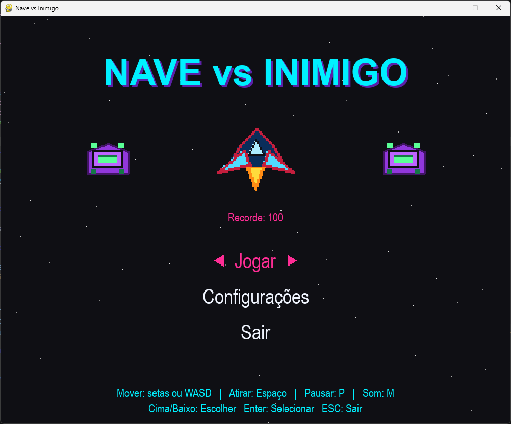
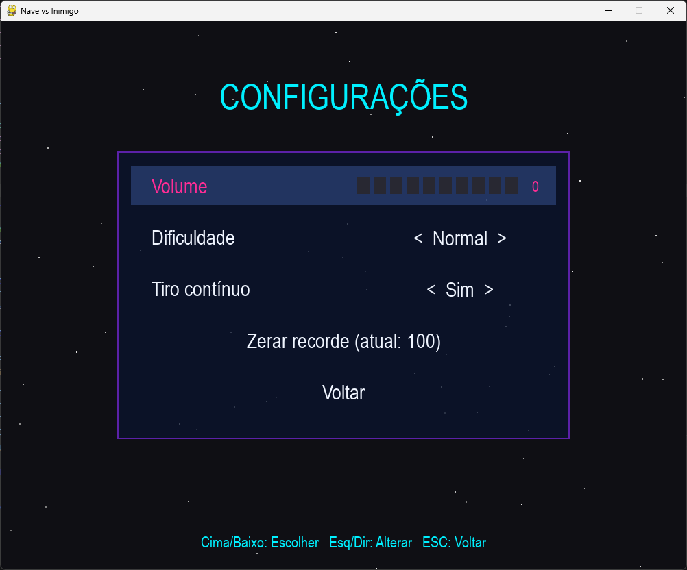

# Nave vs Inimigo 🚀👾

Uma versão evoluída do clássico estilo *Space Shooter* 2D em **Python** e **Pygame**, recheada de efeitos visuais, sistema procedural de som, chefes com padrões únicos de ataque, power-ups e telas de configuração completas.

---

<div align="center">
  
  
</div>

---

## 🌟 O que há de novo?

- 🔊 **Áudio Procedural Interno:** Os efeitos sonoros (tiros, explosões, power-ups, chefes) são sintetizados diretamente no código usando frequências e ondas sonoras (`array` / `math`), dispensando arquivos `.wav` ou `.mp3` externos.
- 👹 **Batalhas contra Chefes:** A cada 5 níveis você enfrenta um chefe poderoso com ataques dinâmicos (*Destruidor*, *Vórtice* e *Caçador*).
- ⚡ **Sistema de Power-ups:** Destaque para itens de **Vida Extra**, **Tiro Triplo** e **Escudo Protetor**.
- ⚙️ **Menu & Configurações In-Game:** Ajuste volume, altere a dificuldade (*Fácil*, *Normal*, *Difícil*), ative/desative tiro contínuo e gerencie recordes.
- 💾 **Persistência de Dados:** Salva automaticamente as suas configurações (`config.json`) e seu recorde de pontuação (`recorde.txt`).
- 💥 **Efeitos Visuais:** Animações de explosão por partículas, tremor de tela (*screen shake*), escudo translúcido e barra de vida animada.

---

## 🎮 Funcionalidades do Jogo

- **Movimentação Suave:** Suporte a setas do teclado e teclas `WASD`.
- **Sistema de Dificuldades Ajustáveis:**
  - **Fácil:** Menos dano sofrido, velocidades moderadas e maior taxa de *drop* de power-ups.
  - **Normal:** O equilíbrio ideal de desafio.
  - **Difícil:** Inimigos mais ágeis, tiros mais frequentes e chefes com mais vida.
- **HUD Completo:** Exibição em tempo real de HP com animação de dano, indicadores temporizados para power-ups ativos e barra de vida para os chefes.
- **Tratamento de Fallback:** Funciona perfeitamente mesmo sem a imagem de fundo `Galaxie.jpg`, gerando um campo de estrelas animadas proceduralmente.

---

## 🤖 Desenvolvimento & Colaboração com IA

Este projeto foi expandido e aprimorado com o auxílio do **Claude (Anthropic)**. 

A inteligência artificial atuou como parceira no desenvolvimento, ajudando na estruturação do código, implementação do gerador de áudio sintético em tempo de execução, modelagem matemática dos padrões de ataque dos chefes e otimização das mecânicas de físicas e partículas do Pygame.

---

## 🛠️ Tecnologias Utilizadas

- **[Python 3.x](https://www.python.org/)**
- **[Pygame](https://www.pygame.org/)**
- **Módulos nativos:** `math`, `array`, `json`, `os`, `random`

---

## 🕹️ Controles e Atalhos

### Durante a Partida

| Ação | Comando |
| :--- | :--- |
| **Mover a Nave** | Setas do teclado (`←` `↑` `→` `↓`) ou `W`, `A`, `S`, `D` |
| **Atirar** | Barra de `Espaço` *(Suporta disparo contínuo)* |
| **Pausar / Despausar** | Tecla `P` |
| **Ativar / Desativar Som (Mute)** | Tecla `M` |
| **Reiniciar (Tela de Game Over)** | Tecla `R` |
| **Menu / Sair** | Tecla `ESC` |

### Nos Menus

| Ação | Comando |
| :--- | :--- |
| **Navegar pelas opções** | Setas `↑` / `↓` ou `W` / `S` |
| **Alterar / Selecionar** | Setas `←` / `→`, `Enter` ou `Espaço` |
| **Voltar** | Tecla `ESC` |

---

## 👾 Tipos de Chefes

1. **DESTRUIDOR:** Lança leques de projéteis em leque pela tela.
2. **VÓRTICE:** Balança de um lado para o outro varrendo a tela com rajadas contínuas.
3. **CAÇADOR:** Persegue a posição horizontal da sua nave e dispara diretamente na sua direção.

---

## 🚀 Como Executar o Projeto

1. **Certifique-se de ter o Python instalado:**
   ```bash
   python --version
   ```
2. Clone o repositório:
   ```bash
   git clone [https://github.com/seu-usuario/seu-repositorio.git](https://github.com/seu-usuario/seu-repositorio.git)
   cd seu-repositorio   
   ```
3. Execute o jogo:
   ```bash
   python main.py
   ```
---

## 📁 Arquivos do Projeto
* `main.py` — Código-fonte completo com engine de jogo, áudio e menus.
* `Galaxie.jpg` — (Opcional) Imagem de fundo para o espaço.
* `recorde.txt` — Arquivo gerado automaticamente para salvar sua maior pontuação.
* `config.json` — Arquivo gerado automaticamente com suas preferências de som e dificuldade.
